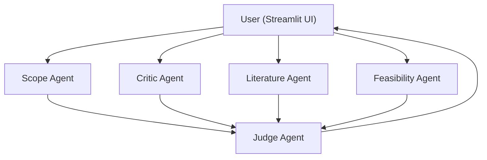

# Thesis Topic Evaluator (Streamlit)

A Streamlit web application that leverages the ReAct (Reasoning + Acting) multi-agent framework to evaluate proposed Bachelor's thesis topics in Software Engineering.

## Features

1. **Scope Agent** – Verifies alignment with Bachelor-level expectations.
2. **Critic Agent** – Highlights vagueness, over-complexity, or unclear goals.
3. **Literature Agent** – Estimates availability of supporting academic literature.
4. **Feasibility Agent** – Assesses practical implementability with common tools and skills.
5. **Judge Agent** – Synthesises previous feedback, issuing an overall decision.

Each agent operates using an LLM via the OpenAI API, following the ReAct methodology to reason step-by-step before acting.

## Architecture



## Setup

1. **Clone & install dependencies**

```bash
python -m venv .venv
source .venv/bin/activate  # on Windows: .venv\Scripts\activate
pip install -r requirements.txt
```

2. **Configure the OpenAI API key**

Create a `.env` file in the project root or export the variable directly:

```bash
echo "OPENAI_API_KEY=YOUR_KEY_HERE" > .env
```

3. **Run the application**

```bash
streamlit run streamlit_app.py
```

Then open the provided local URL (e.g. http://localhost:8501) in your browser.

## Notes

* The default model is `gpt-4o`; adjust in `streamlit_app.py` if needed.
* All agent responses are requested in JSON. If the LLM deviates, the raw output is still shown.
* This project is a proof-of-concept; production deployments should incorporate stronger error handling and rate-limit resilience. 